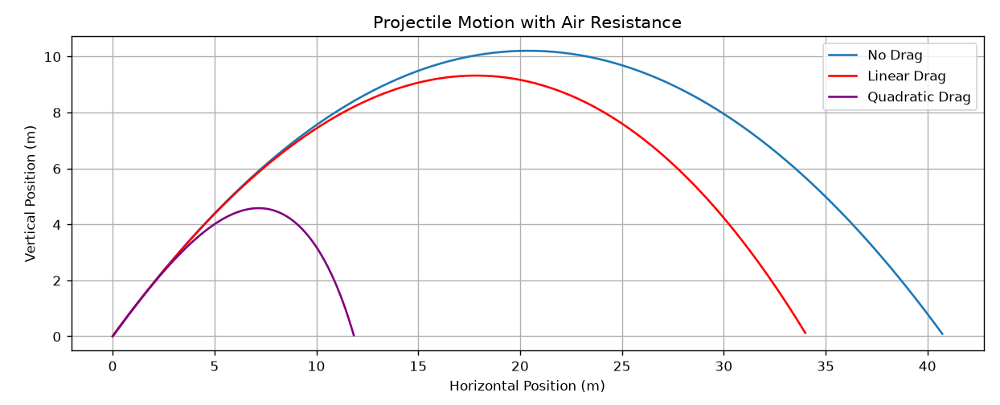
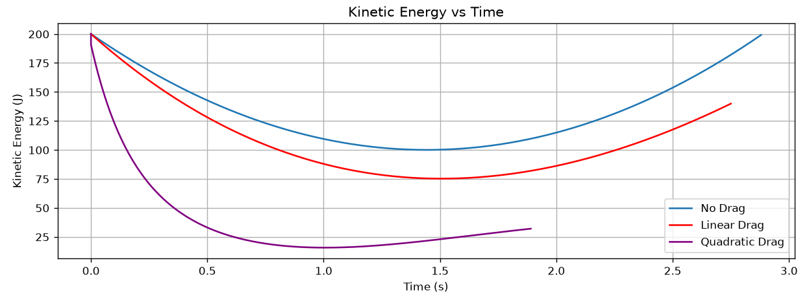

# Projectile Motion with Air Resistance
## Overview
This project simulates projectile motion under three different conditions:
1. No air resistance
2. Linear air resistance
3. Quadratic air resistance

The trajectory and kinetic energy of the projectile are calculated and compared for each case.
The project is written in Python using NumPy and Matplotlib.

## Physical Parameters
The projectile is launched with an initial velocity of $v_0 = 20 \space (m/s)$ at an angle of $\theta = 45^\circ$. The projectile mass is $m = 1 \space (kg)$, and the gravitational acceleration is $g = 9.8 \space (m/s^2)$.

The drag coefficients used in the simulation are:

Linear drag coefficient: $k = 0.1$

Quadratic drag coefficient: $b = 0.1$

The time step is $\Delta t = 0.01 \space (s)$

## Methods

### 1. No Air Resistance
The projectile motion without air resistance is calculated analytically using the standard equations of projectile motion.

### 2. Linear Air Resistance
For linear air resistance, the drag force is proportional to the velocity: $\mathbf{F}_d \propto -\mathbf{v}$. Analytical expressions are used to calculate the projectile's position and velocity.

### 3. Quadratic Air Resistance
For quadratic air resistance, the drag force is proportional to the square of the projectile's speed: $\mathbf{F}_d \propto -v\mathbf{v}$. The equations are solved numerically using the Euler method.
The Euler method is used for this case because an analytical solution is not used in this project.

## Kinetic Energy
The kinetic energy is calculated using $K = \frac{1}{2}mv^2$. It is calculated throughout the simulation and plotted as a function of time for all three cases.

## Results
The program produces two plots:
- Projectile trajectory
- Kinetic energy versus time

### Projectile Trajectory

### Kinetic Energy vs Time

The plots allow the effects of linear and quadratic air resistance to be compared with the ideal case without air resistance.

## Requirements
- Python 3
- NumPy
- Matplotlib

## How to Run

Run the following command from the project directory:

python projectile_motion.py

The program will calculate the projectile motion for all three cases and display the resulting plots.

## Note

This project was created as a physics programming project to explore projectile motion, air resistance, analytical solutions, and numerical methods.
